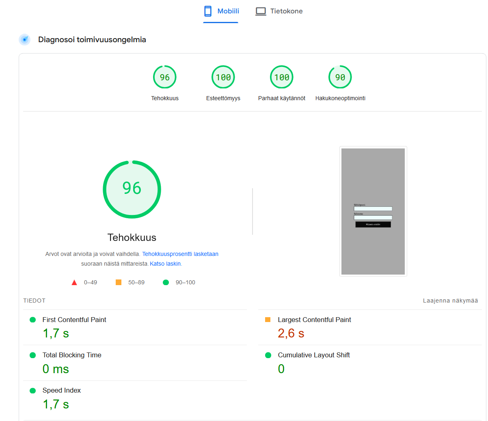
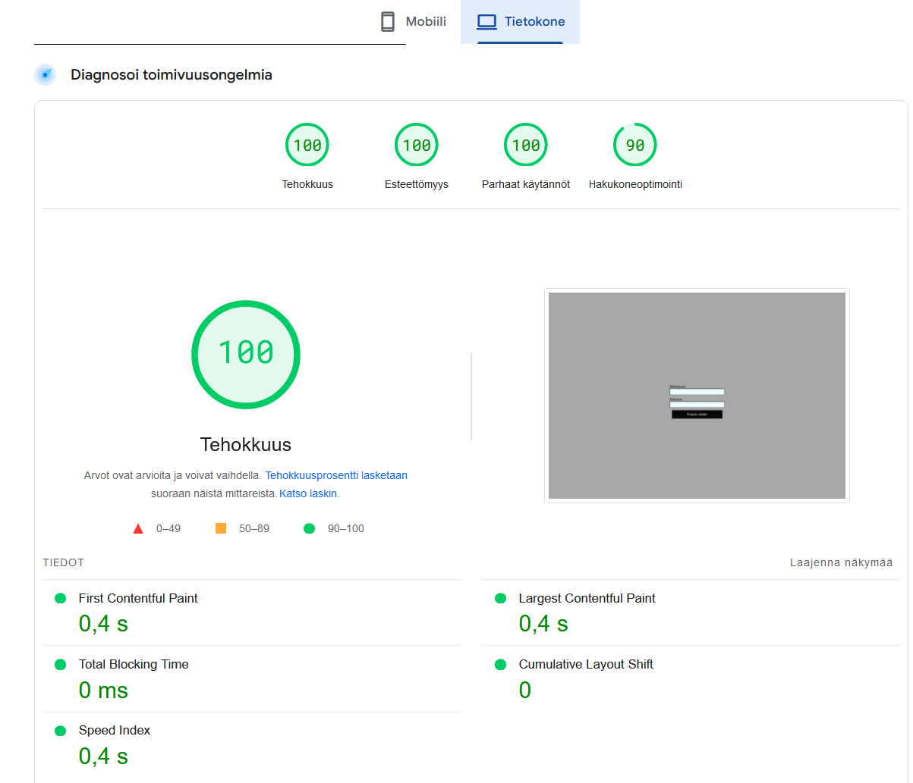

[Viikko 1](./index.md)

## Harjoitustyö

Tällä sivustolla voit etsiä tietoa eri maista. Hakukenttään syöttämällä maan nimen (englanniksi) saat tiedot maan pääkaupungista, 
kielistä, asukasluvusta ja maan lipun. Suosikit sivulla voit käydä lisäämässä tietokantaan oman suosikkimaasi. Lista näyttää jo tietokannasta löytyvät maat. Sovelluksessa on käytetty Firebase-autentikaatiota, Firestore tietokantaa ja tietojen hakemiseen REST Countries API:a. Firebaseen on luotu yksi käyttäjä tunnuksilla: rommi@rusina.fi/salasana1

[Linkki harjoitustyöhön](https://maiju19.github.io/pilvi_harjoitustyo)

## Responsiivisuus

Sivusto toimii erikokoisilla näytöillä. Toimivuutta on testattu Firefoxin ja Chromen kehitystyökaluilla sekä puhelimella ja padilla. Mobiilissa responsiivisuus voisi olla kyllä parempikin, mutta on kuitenkin käyttökelpoinen. Tietokoneella ja padilla skaalautuvuus on hyvä.

## Toimivuus eri selaimilla

Sivusto testattiin Firefoxilla, Chromella, Edgellä ja Safarilla. Kaikissa selaimissa sivusto toimi moitteettomasti paitsi Chromessa ja Edgessä haun tuloksena tuleva maan lippu näkyi vain alueellisena tunnuksena. Firefoxissa ja Safarissa lippu tuli näkyviin. REST Countries API:ssa liput esitettiin Unicode-merkkeinä. MacOs ja iOs tukevat Unicoden emojemerkistöä, joten iPadissa lippu näkyi emojina.

## Sivujen latautumisaika

Latautumisaikojen testaukseen käytettiin PageSpeed Insights työkalua. Testi osoitti, että sivun latausajat ovat hyvät sekä tietokoneella että mobiilissa. 

